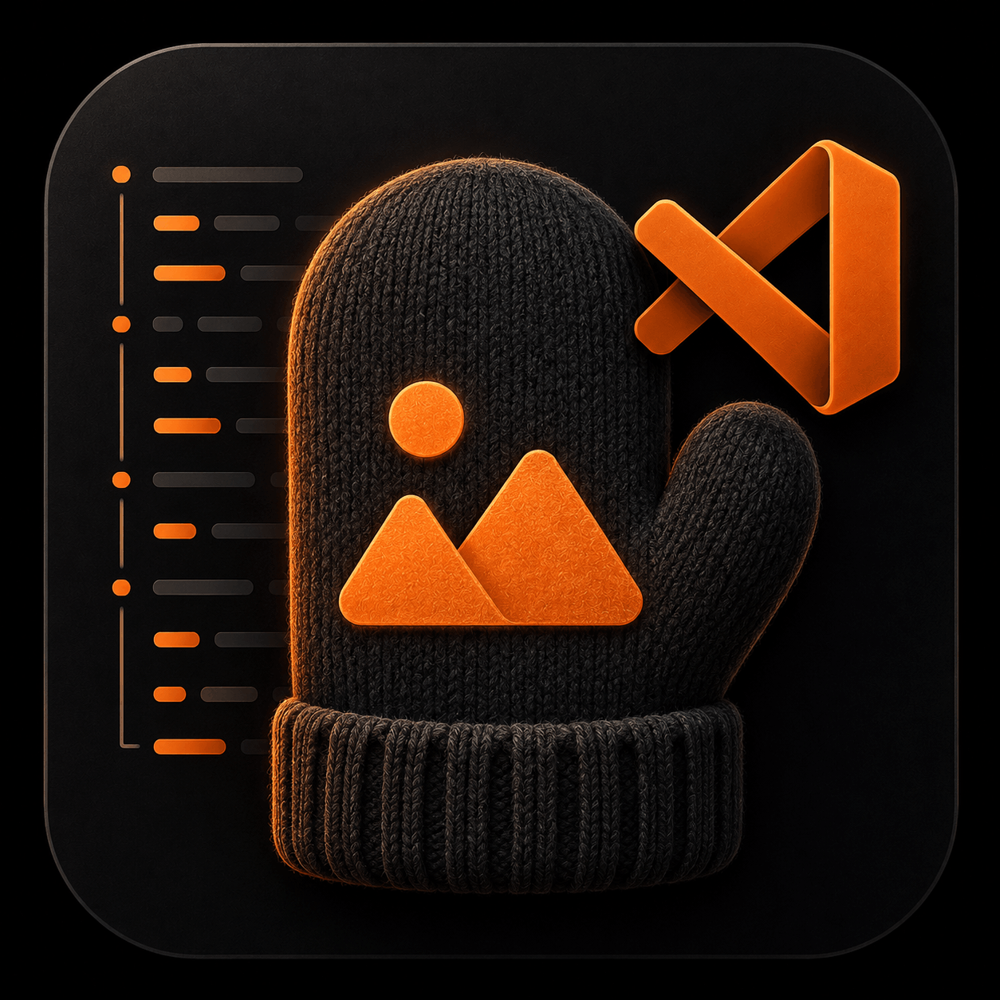
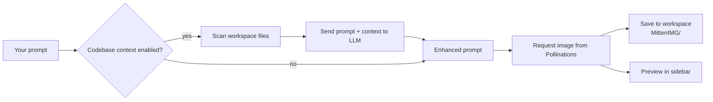

<div align="center">



# MittenIMG

**Generate images for your project without leaving VS Code.**

MittenIMG reads your codebase for context, enhances your prompt with an LLM, and generates an image — right from the sidebar.

[Features](#features) • [Installation](#installation) • [Usage](#usage) • [Configuration](#configuration) • [How it works](#how-it-works)

</div>

---

## Features

- 🖼️ **In-editor image generation** — describe what you want in a sidebar panel and get an image back, no browser tab required.
- 🧠 **Codebase-aware prompts** — optionally scans your open workspace and feeds it to an LLM so the generated prompt reflects your project's actual context (framework, theme, naming, etc.), not just your raw text.
- ✏️ **Image editing / iteration** — take a generated image and use it as the base for a follow-up edit, so you can refine results turn by turn.
- 📐 **Size presets & custom dimensions** — square, landscape, portrait, high-res, or set your own width/height.
- 🔄 **Format conversion** — convert and save results as PNG, JPEG, or WebP with adjustable quality, directly from the panel.
- 💾 **Auto-save to workspace** — every generated image is written to a `MittenIMG/` folder in your project.
- 📄 **Built-in logging** — an output channel shows exactly what was sent and received for easy debugging.

## Installation

Install **MittenIMG** from the Extensions view in VS Code (`Ctrl+Shift+X` / `Cmd+Shift+X`), or from the [VS Code Marketplace](https://marketplace.visualstudio.com/items?itemName=TechRayApps.imagemitten).

## Usage

1. Open the **MittenIMG** icon in the Activity Bar. On first use you'll land on a welcome screen.
2. Click **🔌 Connect Pollinations Account** and approve access in the browser tab that opens — this links your Pollinations account so generations run without you needing to manage an API key. If you'd rather not connect an account, click **Use a manual API key instead** (opens Settings) or **Skip for now** to go straight to the generator.
3. Type a description of the image you want in the prompt box.
4. Pick a size preset (or choose **Custom...** to set your own width/height).
5. Click **Generate**.
6. Once the image appears:
   - Click **Edit This Image** to use it as the base for a follow-up generation.
   - Expand **🔄 Convert to another format** to save it as PNG, JPEG, or WebP.
   - Expand **Prompt Used** to see exactly what prompt was sent to the image model.

A small status line above the prompt box shows your connection state with a **Manage** link — click it anytime to reopen the welcome screen and connect, disconnect, or reconnect your Pollinations account.

Use the toolbar buttons to **📄 Logs** (open the output channel), open **⚙️ Settings**, or toggle **🌐 Context** (codebase-aware prompting) on/off.

Generated images are automatically saved to a `MittenIMG/` folder at the root of your workspace.

## Configuration

### Connecting your Pollinations account (recommended)

Click **🔌 Connect** in the sidebar. MittenIMG opens `enter.pollinations.ai/device` in your browser with a short code pre-filled — approve access there and the sidebar shows **✅ Connected** once it's done. Your connection is stored securely in VS Code's built-in secret storage (not in `settings.json`), expires automatically after a period set by Pollinations (7 days by default), and can be revoked anytime from your [Pollinations dashboard](https://enter.pollinations.ai) or by clicking **Disconnect** in the sidebar.

### Manual API key (fallback)

If you'd rather not connect an account, or already have a Pollinations API key, you can configure it directly under **Settings → Extensions → MittenIMG**, or by editing `settings.json`. It's only used when no account is connected via **Connect**.

| Setting | Type | Default | Description |
|---|---|---|---|
| `imagemitten.useCodebaseContext` | `boolean` | `true` | When enabled, scans your workspace files and uses an LLM to enrich your prompt with project context before generating an image. When disabled, your prompt is sent as-is. |
| `imagemitten.pollinationsApiKey` | `string` | `""` | Manual Pollinations API key, used as a fallback for LLM prompt enhancement, image editing, and authenticated image generation when no account is connected. |
| `imagemitten.contextIgnoreFolders` | `string[]` | `[]` | Additional folder names or glob patterns to exclude from codebase context scanning (e.g. `"test"`, `"build"`, `"**/fixtures/**"`). `node_modules`, `.git`, `dist`, and `out` are always excluded. |

```json
{
  "imagemitten.useCodebaseContext": true,
  "imagemitten.pollinationsApiKey": "YOUR_API_KEY",
  "imagemitten.contextIgnoreFolders": ["test", "build"]
}
```

> **Note:** Without a connected account or a manual API key, MittenIMG skips prompt enhancement and image editing but will still attempt basic image generation.

## How it works



1. **Context gathering** — if enabled, MittenIMG walks your workspace (excluding `node_modules`, `.git`, `dist`, `out`, plus any folders/patterns you add via `imagemitten.contextIgnoreFolders`) and builds a text blob of file contents, capped at a reasonable size.
2. **Prompt enhancement** — that context, along with your prompt, is sent to a text model via the Pollinations API, which returns a richer, more specific image-generation prompt.
3. **Image generation** — the enhanced prompt is sent to Pollinations' image endpoint, with support for custom dimensions and, when editing, a base image.
4. **Delivery** — the resulting image is streamed back into the sidebar and saved into a `MittenIMG/` folder in your workspace.

All requests and responses are logged to the **MittenIMG** output channel for transparency and troubleshooting.

## Requirements

- VS Code `^1.74.0` or later
- A [Pollinations](https://pollinations.ai) account, connected via the sidebar's **🔌 Connect** button, or a manual API key (optional, but required for prompt enhancement and image editing)

## Privacy note

When codebase context is enabled, file contents from your open workspace are sent to a third-party LLM endpoint (via Pollinations) to enhance your prompt. Disable **🌐 Context** in the sidebar, or set `imagemitten.useCodebaseContext` to `false`, if you'd rather your prompt be sent as-is.

## License

[Apache 2.0](LICENSE.md)
